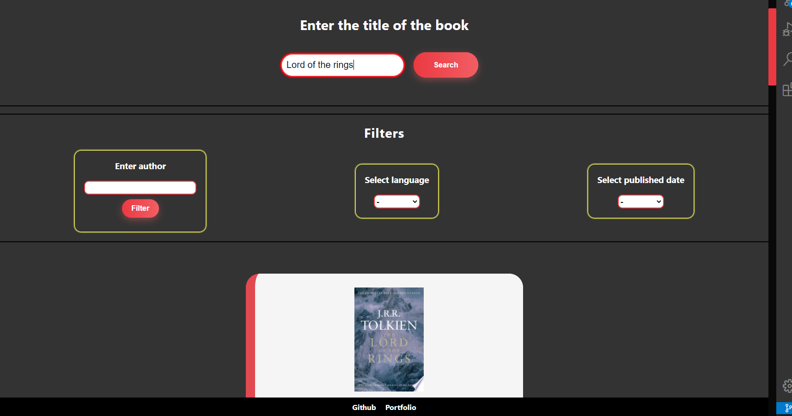

# Search-Books-App

Search-Book-App is an application that is used to search for a book in Google Api by title. All you need to do is enter the title of the book in the text field and you're done. A list of books will be displayed with cover photos (if no cover is available, the default photo will be displayed), title and short description. The user will only see a few books but when scroll down to download more books. The application also allows you to filter the obtained results.

Possible filters:

- author
- language
- published date

## Screen:



## Getting Started

See the program operation in the link below or download the project, download it to your computer. Then follow the instructions.

### Installing

To initiate the project, enter in the terminal:

```
npm install
```

To start a live server, enter in the terminal:

```
npm start
```

To create a distribution version, type in terminal:

```
npm run build
```

To run the tests you need to:

```
npm run test
```

## Built With

- React
- Context
- Hooks
- SCSS
- GIT
- Testing-Library

## Author

- **Jarkowski Tomasz**

## License

For personal use only. Do not distribute.
